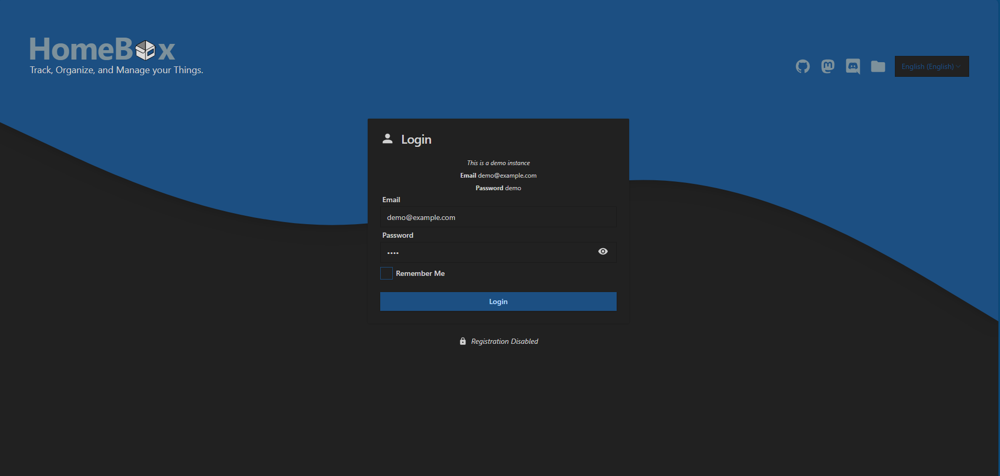
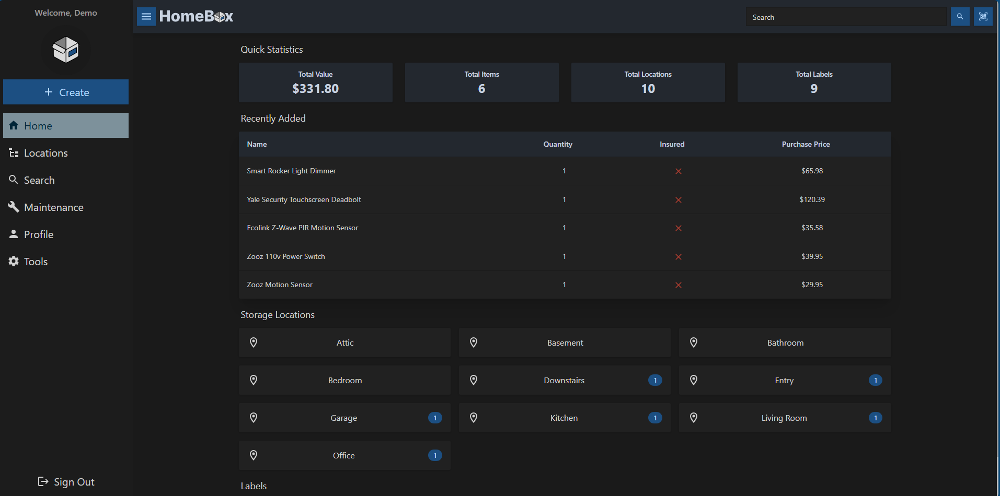
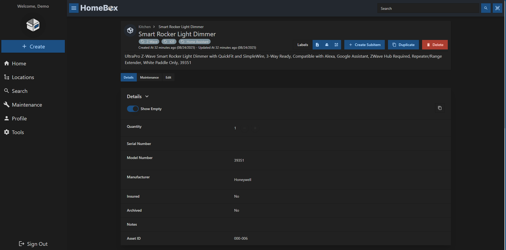
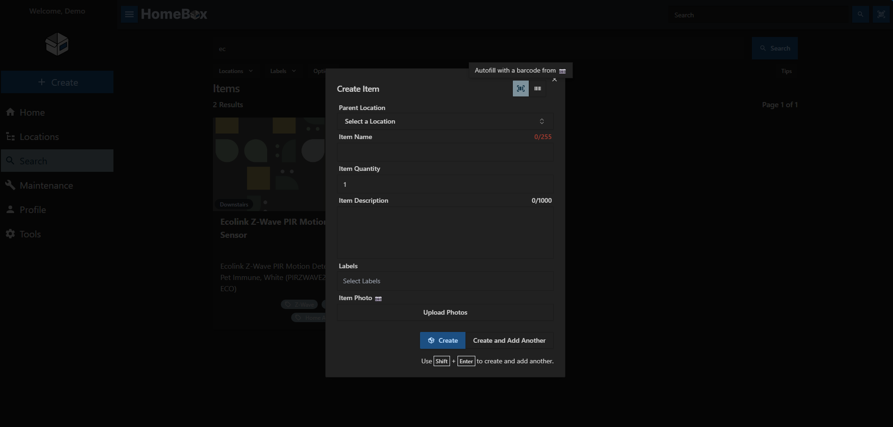
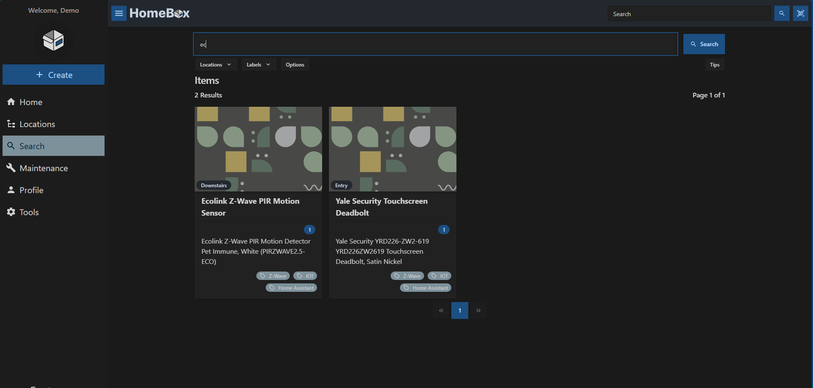

<div align="center">
  
</div>

<h1 align="center" style="margin-top: -10px;"> HomeBox </h1>
<p align="center" style="width: 100%;">
   <a href="https://homebox.software/en/">Docs</a>
   |
   <a href="https://demo.homebox.software">Demo</a>
   |
   <a href="https://discord.gg/aY4DCkpNA9">Discord</a>
</p>
<p align="center" style="width: 100%;">
    
    
    
    
</p>
<p align="center" style="width: 100%;">
    
    
    
</p>
<p align="center" style="width: 100%;">
  <a href="https://www.pikapods.com/pods?run=homebox"></a>
</p>

## What is HomeBox

HomeBox is the inventory and organization system built for the Home User! With a focus on simplicity and ease of use, Homebox is the perfect solution for your home inventory, organization, and management needs. While developing this project, We've tried to keep the following principles in mind:

- 🧘 _Simple but Expandable_ - Homebox is designed to be simple and easy to use. No complicated setup or configuration required. But expandable to whatever level of infrastructure you want to put into it.
- 🚀 _Blazingly Fast_ - Homebox is written in Go, which makes it extremely fast and requires minimal resources to deploy. In general, idle memory usage is less than 50MB for the whole container.
- 📦 _Portable_ - Homebox is designed to be portable and run on anywhere. We use SQLite and an embedded Web UI to make it easy to deploy, use, and backup.

### Key Features
- 📇 Rich Organization - Organize your items into categories, locations, and tags. You can also create custom fields to store additional information about your items.
- 🔍 Powerful Search - Quickly find items in your inventory using the powerful search feature.
- 📸 Image Upload - Upload images of your items to make it easy to identify them.
- 📄 Document and Warranty Tracking - Keep track of important documents and warranties for your items.
- 💰 Purchase & Maintenance Tracking - Track purchase dates, prices, and maintenance schedules for your items.
- 📱 Responsive Design - Homebox is designed to work on any device, including desktops, tablets, and smartphones.

## Screenshots






You can also try the demo instances of Homebox:
- [Demo](https://demo.homebox.software)
- [Nightly](https://nightly.homebox.software)

## Quick Start

[Configuration & Docker Compose](https://homebox.software/en/quick-start.html)

```bash
# If using the rootless or hardened image, ensure data 
# folder has correct permissions
mkdir -p /path/to/data/folder
chown 65532:65532 -R /path/to/data/folder
docker run -d \
  --name homebox \
  --restart unless-stopped \
  --publish 3100:7745 \
  --env TZ=Europe/Bucharest \
  --volume /path/to/data/folder/:/data \
  ghcr.io/sysadminsmedia/homebox:latest
# ghcr.io/sysadminsmedia/homebox:latest-rootless
# ghcr.io/sysadminsmedia/homebox:latest-hardened
```

<!-- CONTRIBUTING -->

## Contributing

Contributions are what make the open source community such an amazing place to learn, inspire, and create. Any contributions you make are **greatly appreciated**.

To get started with code based contributions, please see our [contributing guide](https://homebox.software/en/contribute/get-started.html).

If you are not a coder and can't help translate, you can still contribute financially. Financial contributions help us maintain the project and keep demos running.

## Help us Translate
We want to make sure that Homebox is available in as many languages as possible. If you are interested in helping us translate Homebox, please help us via our [Weblate instance](https://translate.sysadminsmedia.com/projects/homebox/).

[](https://translate.sysadminsmedia.com/engage/homebox/)

## Credits
- Original project by [@hay-kot](https://github.com/hay-kot)
- Logo by [@lakotelman](https://github.com/lakotelman)

### Contributors
<a href="https://github.com/sysadminsmedia/homebox/graphs/contributors">
  
</a>
