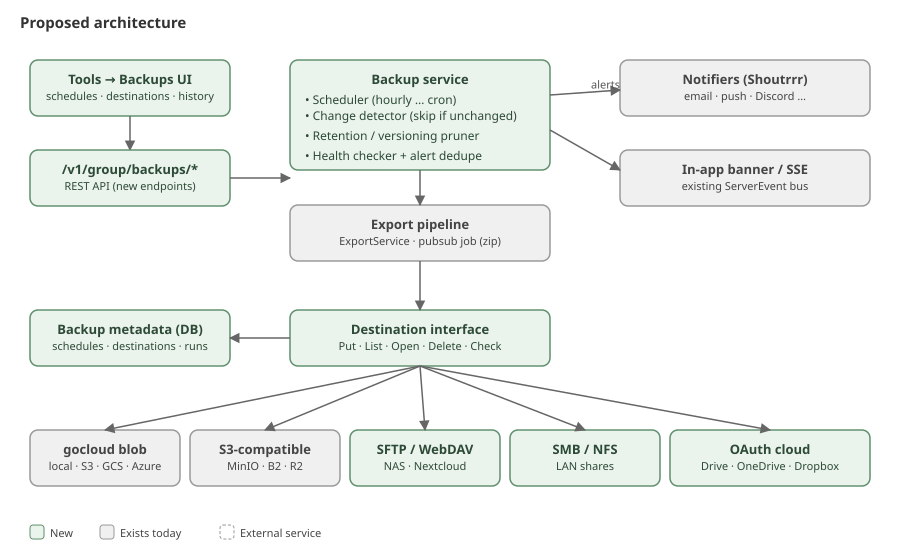
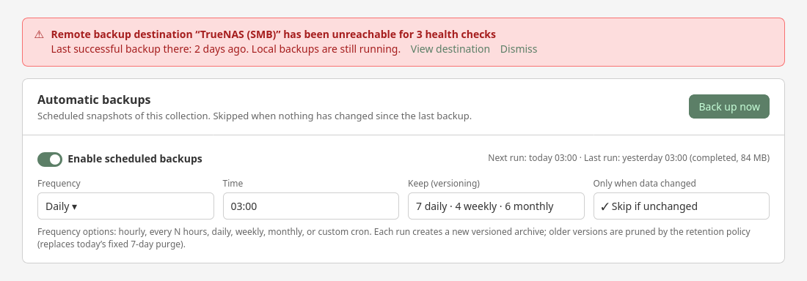
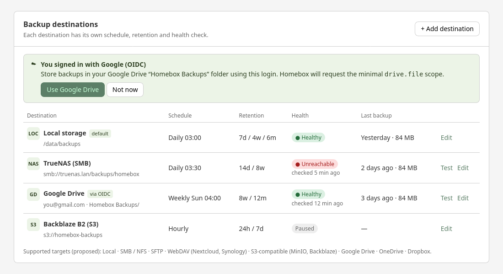
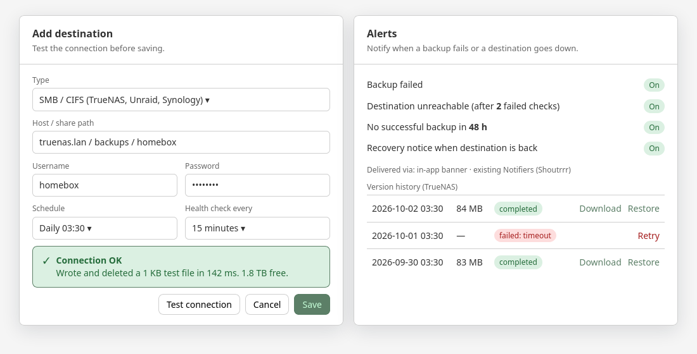
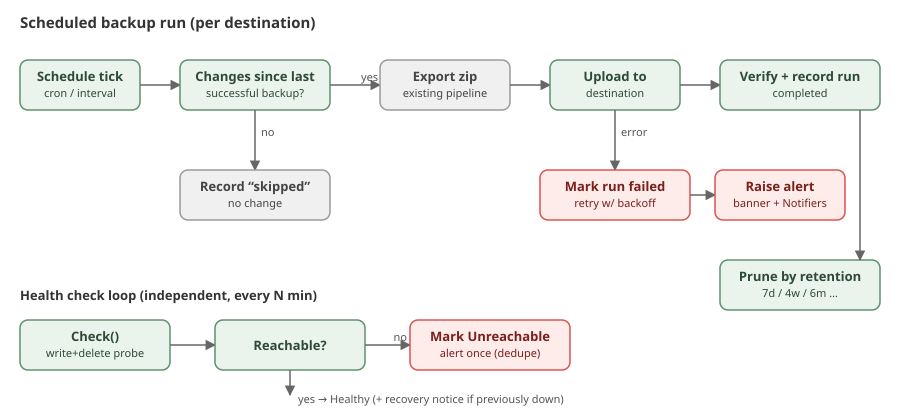
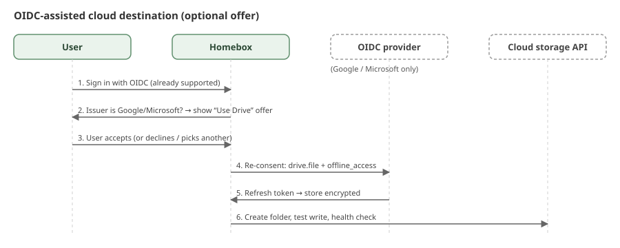

> [!CAUTION]
> **This is a proposal, not a shipped feature.** Nothing on this page is available in HomeBox today. The screenshots are
> static mockups and the diagrams show a suggested design. Discussion: [sysadminsmedia/homebox#1767](https://github.com/sysadminsmedia/homebox/discussions/1767).

## Where we are today

| Capability                                   | Today                                                                                                           |
|----------------------------------------------|-----------------------------------------------------------------------------------------------------------------|
| Create a backup                              | Manual only (Tools → Backups & Restore). There is no scheduler.                                                  |
| Where backups are written                    | The same blob storage as attachments, set by `HBOX_STORAGE_CONN_STRING` (see [Storage](/quick-start/configure/storage/)). |
| Cloud storage                                | Instance-wide only: local, S3-compatible, Google Cloud Storage and Azure Blob. Not Drive, OneDrive or Dropbox.   |
| Separate destination just for backups        | No. Attachments and backups always share one bucket.                                                             |
| Versioning / retention                       | No. Exports older than a fixed 7 days are purged.                                                                |
| Test connection, health check, failure alert | No. A failed job only shows an error on its row.                                                                 |
| OIDC-linked storage                          | No. OIDC is login only.                                                                                          |

So cloud storage is partly possible already, through a **different approach**: one global storage backend for
everything. This proposal builds on it rather than replacing it.

## Proposed approach: hybrid

- `HBOX_STORAGE_CONN_STRING` stays the primary store for attachments and the default backup location, so existing setups
  keep working unchanged.
- **Backup destinations** are an additional, optional list. Each destination has its own schedule, retention and health
  status. They reuse the existing `gocloud.dev/blob` drivers (local, S3-compatible, GCS, Azure) and add new drivers:
  SFTP, WebDAV, SMB/NFS and OAuth cloud providers (Google Drive, OneDrive, Dropbox).
- Credentials entered in the UI are encrypted at rest and never returned by the API.

## What it would look like

### Schedule, versioning and failure banner

Hourly, daily, weekly, monthly or cron. A scheduled run is **skipped when no data or configuration has changed** since
the last successful backup. A manual "Back up now" always runs.

### Destinations, health and the OIDC offer

If OIDC is enabled and the provider has cloud storage (Google, Microsoft), HomeBox offers that account as a
destination. It is only an offer, and any other destination can be chosen instead.

### Test connection, alerts and version history

## How it would work

### Backup run and health checks

- Each run produces a new timestamped archive, so nothing is overwritten.
- Retention is per destination (for example 7 daily, 4 weekly, 6 monthly) and replaces the fixed 7-day purge.
- Alerts go to an in-app banner and the existing Notifiers, and are de-duplicated during a long outage.

### OIDC-assisted cloud destination

> [!NOTE]
> Self-hosted identity providers such as Authentik, Keycloak or Authelia have no cloud storage, so the offer would only
> appear for Google and Microsoft. The OAuth client would also need the extra storage scope enabled, which would be
> documented in the [OIDC guide](/quick-start/configure/oidc/).

## Open questions

- Per-collection (group) or instance-wide admin settings? Export code is group-scoped today.
- Native SMB/NFS, or document "mount it and use a local path"?
- Client-side encryption of archives before upload to third-party clouds?
- Rollout order: scheduler, retention and S3/local path first, then SFTP/WebDAV, then OAuth cloud providers.
