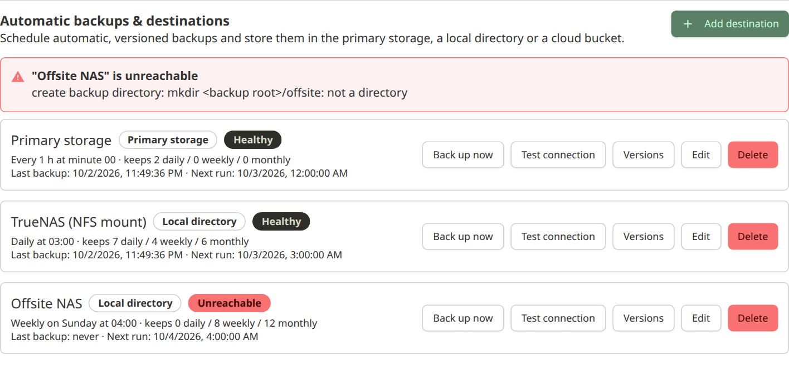
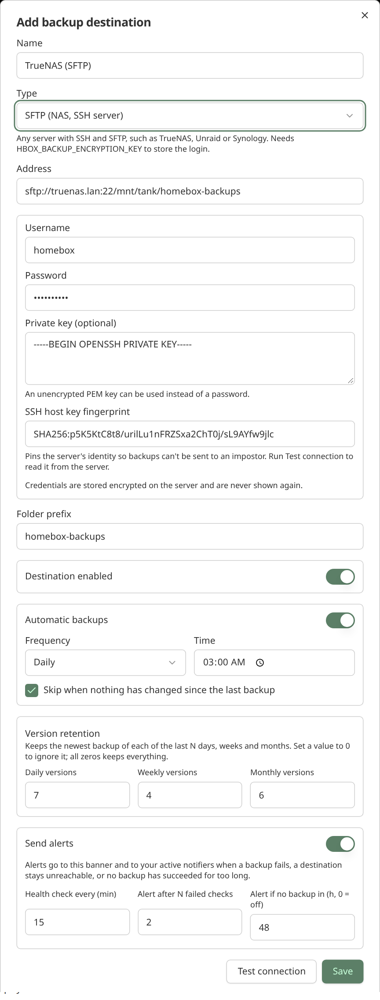
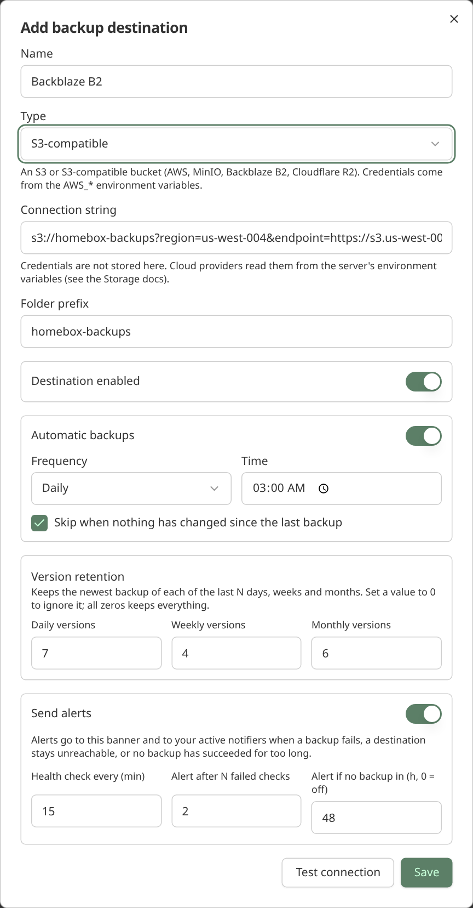
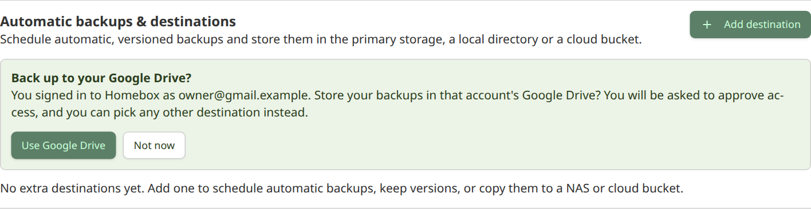

Homebox can back up a collection on a schedule, keep several versions, and write them to a destination of your choice.
Everything is managed by **collection owners** under **Collection → Tools → Backup & Restore**.

A backup is the same zip archive a manual export produces: every entity, tag, custom field, attachment, maintenance
record and notifier in the collection. Restore it with **Upload & Restore** into an empty collection.

> [!NOTE]
> Manual backups (**Start Backup**) still go to the [primary storage](./storage) and are removed after 7 days.
> Backups made by a destination are kept according to that destination's retention policy instead.



## Destinations

Only collection owners can see and manage destinations and the backups they hold. Other members cannot list, download or
delete those backups, even through the general export endpoints.

A destination is a place to write backups to, together with its own schedule, retention, health check and alert
settings. A collection can have up to 20.

| Type                 | Where backups go                                                                 | Credentials                                           |
|----------------------|----------------------------------------------------------------------------------|-------------------------------------------------------|
| Primary storage      | The instance's main storage (`HBOX_STORAGE_CONN_STRING`), next to attachments.   | None needed.                                          |
| Local directory      | A sub-folder of `HBOX_BACKUP_LOCAL_ROOT`, for example a mounted NAS share.       | None needed.                                          |
| S3-compatible        | An `s3://bucket?...` URL: AWS, MinIO, Backblaze B2, Cloudflare R2 and similar.   | `AWS_ACCESS_KEY_ID` and `AWS_SECRET_ACCESS_KEY`       |
| Google Cloud Storage | A `gcs://bucket` URL.                                                            | `GOOGLE_APPLICATION_CREDENTIALS`                      |
| Azure Blob           | An `azblob://container` URL.                                                     | `AZURE_STORAGE_ACCOUNT` and `AZURE_STORAGE_KEY`       |
| SFTP                 | A folder on any SSH server: TrueNAS, Unraid, Synology, a Linux box.              | Username and password or key, stored encrypted        |
| WebDAV               | A WebDAV share: Nextcloud, ownCloud, Synology, an Apache or nginx DAV folder.    | Username and password, stored encrypted               |
| SMB                  | A Windows or Samba share: TrueNAS, Unraid, Synology, Windows.                    | Username and password, stored encrypted               |
| Google Drive         | A folder in a Google account's Drive.                                            | The account is connected in the browser (OAuth)       |
| OneDrive             | The Homebox app folder in a Microsoft account's OneDrive.                        | The account is connected in the browser (OAuth)       |
| Dropbox              | A folder in a Dropbox account.                                                   | The account is connected in the browser (OAuth)       |

The cloud types use the same connection strings and parameters as [Storage](./storage), including `region` for AWS.
S3-compatible servers (MinIO, a NAS) need the `endpoint` and `use_path_style` parameters, and an **operator must turn
on custom endpoints** with `HBOX_BACKUP_ALLOW_CUSTOM_ENDPOINTS=true`. A custom endpoint makes the Homebox server
connect to whatever address a collection owner types in, wherever the server can reach, so it is off by default.

> [!IMPORTANT]
> The S3, Google Cloud Storage and Azure types never store credentials: they read them from the server's environment, and
> a connection string that embeds a username or password is rejected. Only SFTP, WebDAV and SMB store a login, and they store
> it encrypted (see below).

### SFTP and WebDAV

These two types need a login, so they are only available once an operator has set an encryption key, and they make
the Homebox server connect to an address a collection owner enters, so custom endpoints must be switched on too:

```yaml
services:
  homebox:
    environment:
      # openssl rand -base64 32
      HBOX_BACKUP_ENCRYPTION_KEY: "<generated key>"
      HBOX_BACKUP_ALLOW_CUSTOM_ENDPOINTS: "true"
```

Passwords and private keys are sealed with AES-256-GCM before they are saved, are bound to their destination, and are
never returned by the API or shown again. **Keep the key stable and backed up separately**: if it changes, stored logins
can no longer be read and you will need to re-enter them.

- **Address**: `sftp://host[:port]/path` for SFTP, `smb://host[:port]/share[/folder]` for SMB, or the full
  `https://host/path/` URL for WebDAV. Put the username in its own field, not in the URL.
  WebDAV sends the password with every request, so use `https://`. Plain `http://` is accepted for servers on a trusted
  LAN, but anyone on the network path can read the login.
- **SFTP host key**: to make sure backups are only sent to your server, an SFTP destination is pinned to the server's SSH
  host key. Click **Test connection** once. Homebox shows the fingerprint the server presented. Compare it with your server
  (`ssh-keygen -lf /etc/ssh/ssh_host_ed25519_key.pub`), then click **Trust this host key**. If the key ever changes, the
  destination goes unreachable instead of silently trusting the new one.
- **Private key**: SFTP also accepts a PEM private key instead of a password. If the key is protected by a passphrase,
  enter it in the extra field that appears; it is stored sealed with the key.
- **SMB**: Homebox speaks SMB 2 and 3 (not the obsolete SMB 1) and signs in with NTLM. If your server needs a domain, enter
  the username as `DOMAIN\user`. The share must already exist and be writable by that user. Some servers keep deleted files
  in a recycle bin on the share, which then keeps pruned backups until it is emptied.
- **Changing a destination**: saved credentials are only kept while the type, address and username stay the same.
  Otherwise you must enter them again, so a destination can't be re-pointed at another server to collect them.

Uploads are written to a temporary `.part` file and renamed when complete, so a half-finished backup never looks like a
good one.





### Cloud drives (Google Drive, OneDrive, Dropbox)

Cloud drives use OAuth, so you sign in to the provider in a pop-up window and Homebox never sees your password. It keeps
only a **refresh token**, sealed with the encryption key, and asks for the narrowest access each provider offers:
Google's `drive.file` (only files Homebox created), OneDrive's app folder, and Dropbox's app folder.

A provider only appears in the destination form once the server operator has registered an OAuth app for it. This is a
one-time setup per provider, and you need `HBOX_BACKUP_ENCRYPTION_KEY` as well. The
[`backup-config` helper](#generating-the-settings) can generate all of the settings below and print these steps for you:

1. Create the app at the provider (see below) and add this **redirect URI**, using the address you reach Homebox on:
   `https://homebox.example.com/api/v1/group/backup-oauth/callback`
2. Set the app's ID and secret as environment variables, and set `HBOX_OPTIONS_HOSTNAME` (or `HBOX_OPTIONS_TRUST_PROXY`
   behind a proxy) so the redirect URI Homebox sends matches the one you registered.

| Provider    | Variables                                                                                              |
|-------------|--------------------------------------------------------------------------------------------------------|
| Google      | `HBOX_BACKUP_GOOGLE_CLIENT_ID`, `HBOX_BACKUP_GOOGLE_CLIENT_SECRET`                                      |
| Microsoft   | `HBOX_BACKUP_MICROSOFT_CLIENT_ID`, `HBOX_BACKUP_MICROSOFT_CLIENT_SECRET`, `HBOX_BACKUP_MICROSOFT_TENANT` |
| Dropbox     | `HBOX_BACKUP_DROPBOX_CLIENT_ID`, `HBOX_BACKUP_DROPBOX_CLIENT_SECRET`                                    |

**Google.** In the Google Cloud console, enable the *Google Drive API*, configure the OAuth consent screen, and create an
*OAuth client ID* of type *Web application* with the redirect URI above. Add the `.../auth/drive.file` scope. Publish the
consent screen ("In production"): while it is in *Testing*, Google expires refresh tokens after 7 days and backups would
stop. `drive.file` is a non-sensitive scope, so no Google verification review is needed.

**Microsoft.** In the Microsoft Entra admin center, register an application. Choose the supported account types you want
(personal and work accounts, or just one), add a *Web* redirect URI, and create a client secret. Under API permissions add
the delegated Microsoft Graph permissions `Files.ReadWrite.AppFolder` and `offline_access`. Leave
`HBOX_BACKUP_MICROSOFT_TENANT` as `common` to allow any account, or set a tenant ID, `consumers` or `organizations`. Client
secrets expire (at most after 24 months), so renew yours before then.

**Dropbox.** In the Dropbox App Console, create a *Scoped access* app with the *App folder* access type. On the
Permissions tab enable `files.content.write`, `files.content.read` and `account_info.read`, and on the Settings tab add the
redirect URI.

To add a destination, pick the provider, click **Connect**, approve access in the pop-up, then **Test connection** and
**Save**. Use **Reconnect** if you want a different account or access was revoked.


If the account's access is revoked, the destination becomes unreachable and the usual alert is sent. Edit it and
reconnect. Some providers (Microsoft) issue a new refresh token each time one is used; Homebox stores the new one
automatically.

#### Using your Google or Microsoft login

If you sign in to Homebox with [OIDC](./oidc) through **Google** or **Microsoft**, and the matching OAuth app above is
configured, the destinations section offers to back up to that account's Google Drive or OneDrive. Accepting opens the
usual connect pop-up with your login's email preselected, so you only have to approve access. It is only an offer: pick
**Not now** (it will not come back), or choose any other destination.



Homebox does not reuse the tokens from your login. Sign-in tokens are not kept, and backups need their own long-lived
access with a much narrower scope than "sign in". Identity providers without cloud storage (Authentik, Keycloak,
Authelia and similar) get no offer.

> [!NOTE]
> The connection pop-up stays open only while you approve access, and the sign-in is held in the server's memory for
> 10 minutes. If you run several Homebox replicas behind a load balancer, make sure a connection attempt reaches the same
> instance for both steps.

### Using a NAS (TrueNAS, Unraid, Synology)

Most NAS systems offer several ways in. Use whichever you already have set up:

- **SMB**: point an SMB destination at a share on the NAS (`smb://truenas.lan/backups/homebox`).
- **SFTP**: enable the SSH service and point an SFTP destination at a dataset.
- **WebDAV** and **S3-compatible** (MinIO) work as well.
- **NFS**: Homebox has no built-in NFS client. Mount the export on the host and use a local directory:

Make the mounted share available to the container and point `HBOX_BACKUP_LOCAL_ROOT` at it:

```yaml
services:
  homebox:
    environment:
      HBOX_BACKUP_LOCAL_ROOT: /backups
    volumes:
      - /mnt/truenas/homebox-backups:/backups
```

Then add a **Local directory** destination and enter a folder name such as `daily`. Backups are written to
`/backups/daily/`. Folder names cannot leave the backup root.

## Schedule

Turn on **Automatic backups** for a destination and choose how often it runs:

- **Hourly**: every N hours, at a chosen minute.
- **Daily**: at a chosen time.
- **Weekly**: on a chosen weekday and time.
- **Monthly**: on a chosen day (1 to 28) and time.
- **Custom (cron)**: a standard five-field cron expression (`minute hour day month weekday`) or a descriptor such as
  `@daily`. For example `0 3 * * 1-5` runs at 03:00 on weekdays, and `30 2 1,15 * *` at 02:30 on the 1st and 15th.

Times use the server's time zone (set `TZ` in the container to change it). A cron expression can start with
`CRON_TZ=Europe/Paris ` to use another zone. To protect the server, cron schedules must be at least five minutes apart,
and an expression that runs more often (or never) is rejected when you save it.

By default a scheduled run is **skipped when nothing has changed** since the last successful backup. Homebox compares a
fingerprint of the collection's data and settings (row counts and the newest change in every backed-up table), so edits,
additions and deletions are all detected. A skipped run is shown as "Last skipped". **Back up now** always runs.

## Versions and retention

Every run writes a new timestamped archive, so nothing is overwritten. The **Versions** list for a destination lets you
download or delete each one.

Retention keeps the newest backup of each of the last N days, weeks and months. For example `7 / 4 / 6` keeps up to
seven daily, four weekly and six monthly backups. A value of `0` ignores that period, and all zeros keeps everything.
The newest backup is always kept. Pruning runs after each successful backup and deletes the file before its history row.
Failed attempts are listed for 14 days.

## Health checks and alerts

Each destination is probed on its own interval (15 minutes by default) by writing and deleting a 1 KB test object. Use
**Test connection**, in the add or edit dialog or on a saved destination, to run the same probe on demand.

Alerts are sent once per problem, not repeatedly, and a recovery notice follows:

- a backup fails
- a destination fails the configured number of consecutive health checks
- no backup has succeeded for the configured number of hours (set `0` to turn this off). A run skipped because nothing
  changed counts as a success here, and the limit is never shorter than two schedule periods, so a weekly or monthly
  schedule does not alert between its runs even with the default 48 hours

Problems also show as a banner above the destination list. Messages go to the collection's active
[Notifiers](/user-guide/notifiers/).

> [!NOTE]
> Alerts use the normal notifier network rules. If your notification server is on your LAN, you may need to allow it with
> `HBOX_NOTIFIER_ALLOW_NETS` or the `HBOX_NOTIFIER_BLOCK_*` settings.

## Generating the settings

Scheduled backups need a few settings (see [Settings](#settings) below). `backup-config`, built into the Homebox
binary, asks for what you want to use and writes them for you: it generates the encryption key, checks your values,
prints the exact redirect URI and console steps for each cloud provider, and shows the matching `docker compose` lines.

```bash
# In a container, writing the file to the current folder:
docker run --rm -it --user "$(id -u):$(id -g)" -v "$PWD:/out" \
  ghcr.io/sysadminsmedia/homebox:latest backup-config --output /out/backup.env

# With the binary:
./homebox backup-config --output backup.env
```

It walks you through the local backup folder, whether to allow custom endpoints (SFTP, WebDAV, SMB and S3-compatible
servers, which make the server connect to addresses owners type in, so they are off unless you say yes), your public
address, and each cloud drive you want. Secrets are typed
hidden, never printed (previews show only the first characters) and the file is created readable by you alone. Then load
the file in compose with `env_file: [backup.env]` and restart Homebox.

A few things it does for you:

- **Keeps your key.** If the file already has an encryption key it is reused. Replacing it makes every stored SFTP, WebDAV,
  SMB and cloud-drive login unreadable, so that only happens with `--rotate-key`, with a warning.
- **Edits in place.** Running it again to add a provider updates only the backup settings. Comments and other variables in
  the file are kept, and the previous file is saved as `backup.env.bak`.
- **Catches mistakes before you do.** It rejects a provider ID without a secret, a public `http://` address (providers
  require HTTPS), values that are unsafe in a `.env` file, a relative backup folder, and an HTTPS address without
  `--behind-proxy`. Homebox itself serves plain HTTP, so an HTTPS address means a reverse proxy sits in front, and Homebox
  must trust its `X-Forwarded-*` headers to build the right redirect URI.

For scripts, pass everything as flags and add `--non-interactive`. Prefer the prompt for secrets, since flags are visible in
shell history and process lists.

```bash
./homebox backup-config --non-interactive --yes --output backup.env \
  --base-url https://homebox.example.com --behind-proxy \
  --local-root /backups \
  --google-client-id "$GOOGLE_ID" --google-client-secret "$GOOGLE_SECRET"
```

| Flag                                                   | Meaning                                                                          |
|--------------------------------------------------------|----------------------------------------------------------------------------------|
| `--output FILE`                                        | The env file to create or update (default `.env`).                               |
| `--stdout`                                             | Print the file to stdout instead (prompts go to stderr). With `--output`, an existing file is merged but not changed. |
| `--dry-run`                                            | Show what would change and write nothing.                                        |
| `--yes`, `--non-interactive`                           | Skip the confirmation, or never prompt.                                          |
| `--base-url`, `--behind-proxy`                         | How users reach Homebox, and that a TLS proxy is in front.                        |
| `--local-root`                                         | Folder inside the container for local-directory backups.                         |
| `--allow-custom-endpoints`                             | Let collection owners use SFTP, WebDAV and SMB servers and S3-compatible endpoints. Off unless you pass this. |
| `--encryption-key`, `--rotate-key`                     | Use your own key, or replace an existing one.                                    |
| `--google-*`, `--microsoft-*`, `--microsoft-tenant`, `--dropbox-*` | The OAuth app credentials for each cloud drive.                      |

> [!CAUTION]
> The generated file contains secrets. Keep it out of version control, and keep a separate backup of the encryption key.

## Settings

| Variable                             | Default | Description                                                                                  |
|--------------------------------------|---------|----------------------------------------------------------------------------------------------|
| `HBOX_BACKUP_ENABLED`                | `true`  | Turns destinations, the scheduler and health checks on or off. Manual exports are unaffected. |
| `HBOX_BACKUP_LOCAL_ROOT`             |         | Directory local destinations live under. Empty disables local destinations.                  |
| `HBOX_BACKUP_ALLOW_CUSTOM_ENDPOINTS` | `false` | Let collection owners use cloud URLs with a custom `endpoint`, and SFTP, WebDAV and SMB servers. Off by default: it makes the server connect to addresses owners enter. |
| `HBOX_BACKUP_ENCRYPTION_KEY`         |         | Seals SFTP, WebDAV, SMB and cloud-drive logins at rest. Required for those types. Keep it stable. |
| `HBOX_BACKUP_GOOGLE_CLIENT_ID` / `_SECRET` |   | OAuth app for Google Drive destinations.                                                     |
| `HBOX_BACKUP_MICROSOFT_CLIENT_ID` / `_SECRET` / `_TENANT` | `common` for the tenant | OAuth app for OneDrive destinations.                              |
| `HBOX_BACKUP_DROPBOX_CLIENT_ID` / `_SECRET` |  | OAuth app for Dropbox destinations.                                                          |

## Limits

- A destination's **type, address and folder prefix cannot be changed while it holds backups**, because each stored file
  is found again through those settings. Delete its backups first, or add a new destination. The name, schedule,
  retention and alert settings can always be edited.
- A backup that stops partway (a crash or restart) is marked failed after six hours without progress, so it cannot block
  the destination forever.
- Deleting a destination removes it and its history, but **does not delete files** already written to it.
- There is no built-in NFS client. Mount the export on the host and use a local directory, or use SMB, SFTP or WebDAV.
  See the [discussion](https://github.com/sysadminsmedia/homebox/discussions/1767) for what is planned.
- Each cloud drive needs an OAuth app registered by the server operator. An OIDC login only suggests the matching drive
  and preselects the account; it does not skip the approval step.
- Deleting a cloud-drive destination does not revoke Homebox's access in the provider's account settings; remove it there
  as well if you no longer want it.
- Scheduled backups are not available in demo mode.
- A pending cloud-drive sign-in is held in memory by the Homebox process that started it. With several replicas, keep
  the sign-in popup on one replica (sticky sessions).
- To restore from a destination, download the archive and use **Upload & Restore**. There is no one-click restore from a
  destination yet.
- OAuth app credentials are set through environment variables only.
- Strings are English only; other languages fall back to English until translated.

## Roadmap

These are not available today. They are ideas, not commitments.

**Needs verification**

- The Google Drive, OneDrive and Dropbox sign-in flows and the OIDC offer are covered by tests against fake servers.
  They still need checking against real provider accounts.
- SMB signing and encryption, and end-to-end tests against real SFTP, WebDAV and SMB servers in CI.

**Possible additions**

- A settings page for administrators to enter OAuth app credentials, instead of environment variables.
- Restore directly from a destination.
- Client-side encryption of archives before upload.
- Verifying an uploaded archive after the upload finishes.
- More destinations, such as Box, a native Backblaze B2 client and SFTP agent authentication.
- Choosing which notifier receives alerts for each destination.
- Backup size and duration metrics.
- A time zone per destination schedule.
- A retention setting for failed runs.
- Retries with backoff, and bandwidth throttling.
- Keeping pending sign-ins in the database so replicas can share them.
- A troubleshooting page and upgrade notes.
