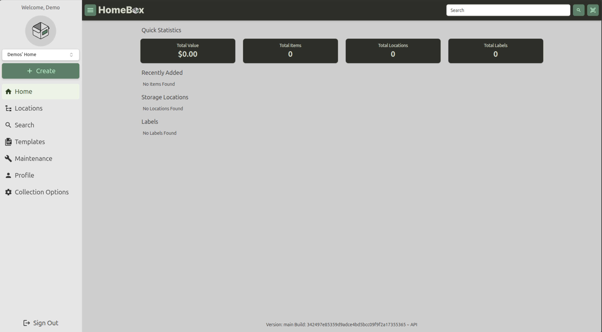

import { Steps } from '@astrojs/starlight/components'

You've installed, and managed to get to the Homebox login page. Now what?

## Registering Your Account
To get started with Homebox, you'll need to create an account. Follow these steps:

<Steps>
1. Click on the "Register" button on the login page.
2. Fill in the required information, including your username, email address, and password.
3. Submit the registration form to create your account.
</Steps>

## Logging In
Once you've registered, you can log in to your Homebox account:
<Steps>
1. Enter your username and password on the login page.
2. Click the "Login" button to access your dashboard.
</Steps>

Once logged in, you'll see that your part of a default Collection called `<Name>'s Collection`. With the rest being empty:

You can start adding Locations and Items right away!

See our extra guides on [Adding Locations](/en/user-guide/locations#adding-a-location) and [Adding Items](/en/user-guide/items) to get started.