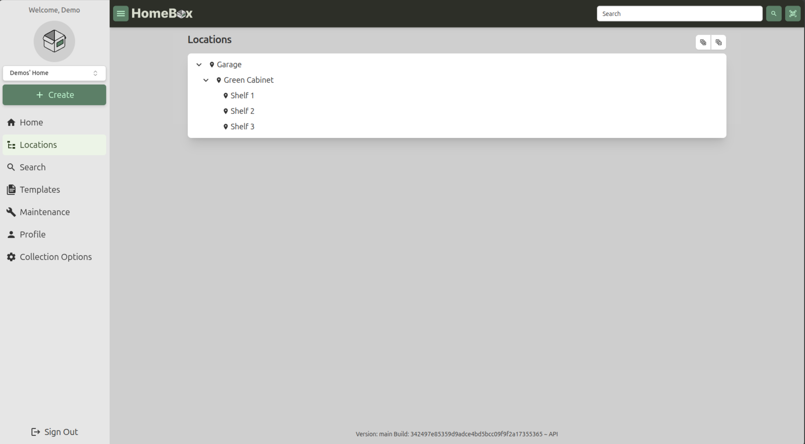

import {Steps} from "@astrojs/starlight/components";

Locations form the basis for organizing your items within Homebox. They represent the physical or logical places where
your items are stored, such as rooms in a house, shelves in a warehouse, or categories in a collection. By defining locations,
you can manage and track where each item is kept. Importantly, Locations can be nested within each other,
allowing for a hierarchical structure that reflects real-world storage systems.

## Working with Locations
### Adding a Location
To add a new location in Homebox, follow these steps:

<Steps>
    1. Click on the "Create" button in the upper left corner of the dashboard.
    2. Select "Location" from the dropdown menu that appears.
    3. Fill in the required details for the new location, such as its name and description.
    4. If you want to nest this location within an existing one, select the parent location from the "Parent Location" dropdown.
    5. Click "Create" to create the location, or "Create and Add Another" to create the location and immediately start adding another one.
</Steps>

### Edit a Location
To edit an existing location, follow these steps:
<Steps>
    1. Navigate to the location you want to edit or delete in the Locations tree.
    2. Click on the location to open its details page.
    3. To edit the location, click the "Edit" button, make your changes, and then save them.
</Steps>

### Delete a Location
To delete a location, follow these steps:
<Steps>
    1. Navigate to the location you want to delete in the Locations tree.
    2. Click on the location to open its details page.
    3. Click the "Delete" button and confirm the deletion when prompted.
</Steps>