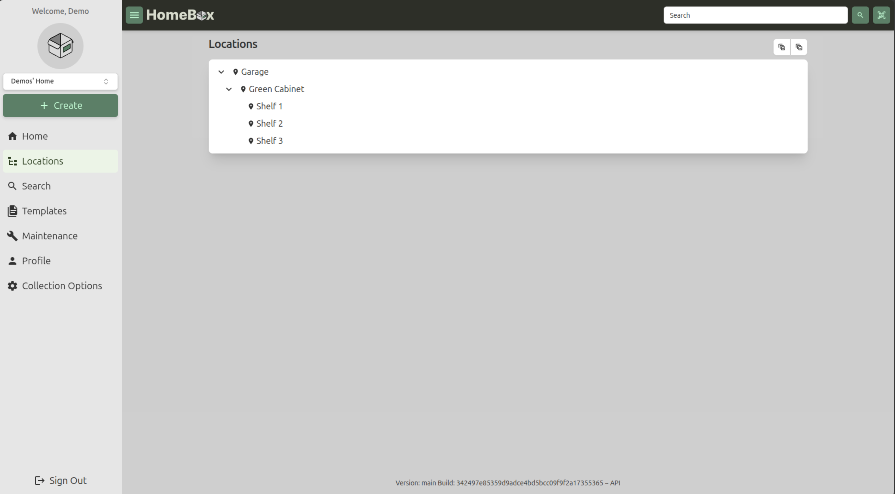

import { Steps } from "@astrojs/starlight/components";

Locations form the basis for organizing your entities within Homebox. They represent the physical or logical places where
your items are stored, such as rooms in a house, shelves in a warehouse, or categories in a collection. By defining locations,
you can manage and track where each item is kept. Importantly, locations can be nested within each other,
allowing for a hierarchical structure that reflects real-world storage systems.

Locations are entities with a location-type [entity type](/en/user-guide/entity-types). This means they share all the
capabilities of items — photos, tags, custom fields, attachments, notes, and asset IDs — while also acting as containers
that can hold other entities.

## Working with Locations
### Adding a Location
To add a new location in Homebox, follow these steps:

<Steps>
    1. Click on the "Create" button in the upper left corner of the dashboard.
    2. Select "Location" from the dropdown menu that appears.
    3. Fill in the required details for the new location, such as its name and description.
    4. If you want to nest this location within an existing one, select the parent location from the "Parent Location" dropdown.
    5. Optionally upload photos of the location.
    6. Click "Show more" to access additional fields like tags and notes.
    7. Click "Create" to create the location, or "Create and Add Another" to create the location and immediately start adding another one.
</Steps>

> [!NOTE]
> If you have multiple location-type entity types defined, a type selector will appear in the creation form.
> Selecting a type with a default template will pre-fill the form with the template's values.

### Editing a Location
Locations now have a full edit page with the same capabilities as items:

<Steps>
    1. Navigate to the location you want to edit in the Locations tree.
    2. Click on the location to open its details page.
    3. Click the "Edit" button to open the edit page.
    4. Edit the location's name, description, notes, tags, custom fields, and attachments.
    5. Enable "Advanced" mode to access custom fields.
    6. Click "Save" to save your changes. You can also use Ctrl+S (or Cmd+S on Mac) to save.
</Steps>

### Deleting a Location
To delete a location, follow these steps:
<Steps>
    1. Navigate to the location you want to delete in the Locations tree.
    2. Click on the location to open its details page.
    3. Click the "Delete" button and confirm the deletion when prompted.
</Steps>

> [!CAUTION]
> Deleting a location will also delete all items stored within it. Make sure to move any items you want to
> keep to a different location before deleting.

### Location Detail Page
The location detail page displays:

- **Photo gallery** — Any photos uploaded to the location, displayed as a clickable grid
- **Header** — Name, parent breadcrumb, total value of contained items, creation date, and tags
- **Description** — Rendered as markdown
- **Notes and custom fields** — Additional details in a collapsible section
- **Attachments** — Non-photo files (documents, manuals, etc.)
- **Items** — All items stored in this location
- **Child locations** — Sub-locations nested within this location

### Location Constraints
- Locations can only have other locations as parents — you cannot place a location inside an item.
- Items can be placed inside locations, but locations cannot be placed inside items.
